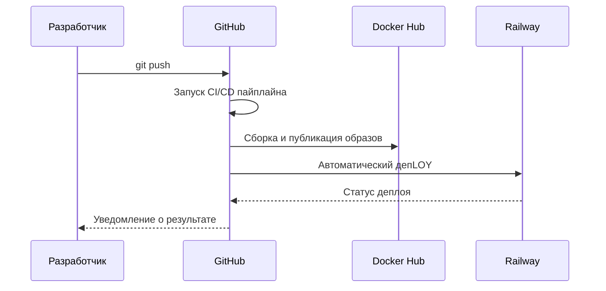

# 🌟 Полное руководство по CI/CD для проекта STROYKA

## 🧭 Оглавление
1. [Введение в CI/CD](THEORY.md)
2. [Настройка Docker Hub с нуля](DOCKERHUB_SETUP.md)
3. [GitHub Actions для начинающих](GITHUB_ACTIONS_GUIDE.md)
4. [Деплой на Railway шаг за шагом](RAILWAY_DEPLOY.md)
5. [Решение проблем CI/CD](TROUBLESHOOTING.md)
6. [Оптимизация пайплайна](OPTIMIZATION_TIPS.md)
7. [Глоссарий терминов](GLOSSARY.md)
8. [Чеклист настройки](SETUP_CHECKLIST.md)
9. [Первый запуск](FIRST_RUN.md)

## 🚀 Быстрый старт
### Шаг 1: Предварительные требования
- Аккаунт на [GitHub](https://github.com/)
- Аккаунт на [Docker Hub](https://hub.docker.com/)
- Аккаунт на [Railway](https://railway.app/)

### Шаг 2: Базовая настройка
```bash
# Клонируем репозиторий
git clone https://github.com/your-username/stroyka.git
cd stroyka

# Устанавливаем зависимости
cd client && npm install
cd ../server && npm install
```

### Шаг 3: Первый запуск CI/CD
1. Добавьте файлы в Git: `git add .`
2. Сделайте коммит: `git commit -m "Initial setup"`
3. Запушьте изменения: `git push origin main`

## 🔍 Что происходит после push?


## 📚 Подробные руководства
Каждому аспекту CI/CD посвящен отдельный файл с пошаговыми инструкциями:

### 1. [Теория CI/CD](THEORY.md)
- Основные принципы Continuous Integration
- Разница между CI, CD и CD
- Преимущества автоматизации

### 2. [Настройка Docker Hub](DOCKERHUB_SETUP.md)
- Создание аккаунта
- Генерация токенов доступа
- Создание репозиториев
- Проверка доступа

### 3. [GitHub Actions](GITHUB_ACTIONS_GUIDE.md)
- Структура YAML файлов
- Основные компоненты workflow
- Переменные окружения и секреты
- Просмотр логов и отладка

### 4. [Деплой на Railway](RAILWAY_DEPLOY.md)
- Регистрация и настройка проекта
- Получение API токена
- Конфигурация окружения
- Мониторинг деплоев

### 5. [Решение проблем](TROUBLESHOOTING.md)
- Ошибки сборки образов
- Проблемы аутентификации
- Сбои при деплое
- Оптимизация времени выполнения

### 6. [Оптимизация](OPTIMIZATION_TIPS.md)
- Кэширование зависимостей
- Параллельное выполнение задач
- Многоступенчатые сборки
- Уменьшение размера образов

### 7. [Глоссарий](GLOSSARY.md)
- 50+ терминов CI/CD с пояснениями
- Основные команды Docker
- Ключевые понятия GitHub Actions

### 8. [Чеклист настройки](SETUP_CHECKLIST.md)
- Пошаговая проверка всех компонентов
- Валидация настроек перед запуском
- Быстрая диагностика проблем

### 9. [Первый запуск](FIRST_RUN.md)
- Пошаговое руководство для первого запуска
- Мониторинг выполнения пайплайна
- Проверка результатов и устранение неполадок

## 💡 Советы для новичков
1. Всегда проверяйте логи при ошибках
2. Начинайте с простых workflow
3. Используйте секреты для хранения чувствительных данных
4. Тестируйте изменения на ветке dev перед main
5. Регулярно обновляйте базовые образы
6. Следуйте чеклисту настройки для избежания ошибок
7. Используйте руководство по первому запуску для уверенного старта

> ⏱️ Полная настройка займет 30-60 минут. Если возникнут трудности - обращайтесь к соответствующим руководствам.