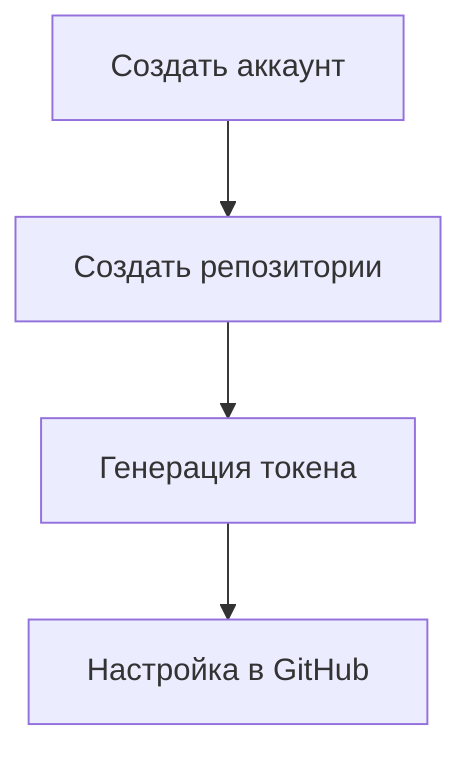

# 🐳 Настройка Docker Hub с нуля для проекта STROYKA

## 📋 Введение

Docker Hub - это облачный реестр для хранения Docker образов. В этом руководстве мы пошагово настроим Docker Hub для вашего проекта.

## 🧭 Оглавление

1. [Введение в CI/CD](THEORY.md)
2. [Настройка Docker Hub с нуля](DOCKERHUB_SETUP.md)
3. [GitHub Actions для начинающих](GITHUB_ACTIONS_GUIDE.md)
4. [Деплой на Railway шаг за шагом](RAILWAY_DEPLOY.md)
5. [Решение проблем CI/CD](TROUBLESHOOTING.md)
6. [Оптимизация пайплайна](OPTIMIZATION_TIPS.md)
7. [Глоссарий терминов](GLOSSARY.md)
8. [Чеклист настройки](SETUP_CHECKLIST.md)
9. [Первый запуск](FIRST_RUN.md)



## 🚀 Шаг 1: Создание аккаунта

1. Перейдите на [Docker Hub](https://hub.docker.com/)
2. Нажмите "Sign Up"
3. Заполните форму:
   - Имя пользователя: `dencheny123` (ваше уникальное имя)
   - Email: ваш действительный email
   - Пароль: надежный пароль
4. Подтвердите email через письмо

## 🏗️ Шаг 2: Создание репозиториев

Нам нужно 2 репозитория:

1. Для клиентской части: `stroyka-client`
2. Для серверной части: `stroyka-server`

### Инструкция:

1. Залогиньтесь в Docker Hub
2. Нажмите "Create Repository"
3. Для клиента:
   - Name: `stroyka-client`
   - Visibility: Public
   - Description: "Frontend for STROYKA project"
4. Для сервера:
   - Name: `stroyka-server`
   - Visibility: Public
   - Description: "Backend for STROYKA project"

> 🔒 Public репозитории бесплатны, private требуют подписки

## 🔑 Шаг 3: Генерация токена доступа

Токен нужен для автоматической публикации образов из CI/CD.

1. Нажмите на ваш профиль → "Account Settings"
2. Перейдите в "Security" → "New Access Token"
3. Заполните:
   - Description: "STROYKA CI/CD Token"
   - Access type: Read, Write, Delete (все права)
4. Нажмите "Generate"
5. Скопируйте токен (он покажется только один раз!)

> ⚠️ Сохраните токен в надежном месте! Пример: `dckr_pat_qLV80-p48gJYwAqhaNzIq-PzlRo`

## 🔧 Шаг 4: Настройка в GitHub

Добавим секреты в репозиторий проекта:

1. Откройте ваш репозиторий на GitHub
2. Перейдите: Settings → Secrets and variables → Actions
3. Нажмите "New repository secret"

### Добавьте 2 секрета:

1. `DOCKERHUB_USERNAME`
   - Value: `dencheny123` (ваш логин Docker Hub)
2. `DOCKERHUB_PASSWORD`
   - Value: ваш токен доступа (например, `dckr_pat_qLV80-p48gJYwAqhaNzIq-PzlRo`)

## 🧪 Шаг 5: Проверка доступа

Проверим, что все настроено правильно:

```bash
# В терминале проекта
docker login -u dencheny123
# Введите ваш токен при запросе пароля

# Проверьте подключение
docker pull hello-world
docker run hello-world
```

## 🖼️ Примеры репозиториев

Вот как должны выглядеть ваши репозитории:

### stroyka-client

```
https://hub.docker.com/r/dencheny123/stroyka-client
```

### stroyka-server

```
https://hub.docker.com/r/dencheny123/stroyka-server
```

## ❓ Частые проблемы и решения

### Ошибка: "denied: requested access to the resource is denied"

- 🔍 Проверьте правильность логина и токена
- 🔄 Убедитесь, что репозитории существуют
- 🔒 Проверьте права токена (должны быть Write)

### Ошибка: "unauthorized: authentication required"

- ⏳ Подождите 5-10 минут после создания токена
- 🔑 Перегенерируйте токен
- 🖥️ Попробуйте выйти и заново войти: `docker logout` → `docker login`

### Как обновить токен в GitHub?

1. Сгенерируйте новый токен в Docker Hub
2. Обновите секрет `DOCKERHUB_PASSWORD` в GitHub
3. Удалите старый токен в Docker Hub

## 📚 Дополнительные материалы

- [Официальная документация Docker Hub](https://docs.docker.com/docker-hub/)
- [Управление репозиториями](https://docs.docker.com/docker-hub/repos/)
- [Лучшие практики безопасности](https://docs.docker.com/engine/security/)

Теперь Docker Hub готов к работе с вашим CI/CD пайплайном! 🎉

## 📚 Подробные руководства

Каждому аспекту CI/CD посвящен отдельный файл с пошаговыми инструкциями:

### 1. [Теория CI/CD](THEORY.md)

- Основные принципы Continuous Integration
- Разница между CI, CD и CD
- Преимущества автоматизации

### 2. [Настройка Docker Hub](DOCKERHUB_SETUP.md)

- Создание аккаунта
- Генерация токенов доступа
- Создание репозиториев
- Проверка доступа

### 3. [GitHub Actions](GITHUB_ACTIONS_GUIDE.md)

- Структура YAML файлов
- Основные компоненты workflow
- Переменные окружения и секреты
- Просмотр логов и отладка

### 4. [Деплой на Railway](RAILWAY_DEPLOY.md)

- Регистрация и настройка проекта
- Получение API токена
- Конфигурация окружения
- Мониторинг деплоев

### 5. [Решение проблем](TROUBLESHOOTING.md)

- Ошибки сборки образов
- Проблемы аутентификации
- Сбои при деплое
- Оптимизация времени выполнения

### 6. [Оптимизация](OPTIMIZATION_TIPS.md)

- Кэширование зависимостей
- Параллельное выполнение задач
- Многоступенчатые сборки
- Уменьшение размера образов

### 7. [Глоссарий](GLOSSARY.md)

- 50+ терминов CI/CD с пояснениями
- Основные команды Docker
- Ключевые понятия GitHub Actions

### 8. [Чеклист настройки](SETUP_CHECKLIST.md)

- Пошаговая проверка всех компонентов
- Валидация настроек перед запуском
- Быстрая диагностика проблем

### 9. [Первый запуск](FIRST_RUN.md)

- Пошаговое руководство для первого запуска
- Мониторинг выполнения пайплайна
- Проверка результатов и устранение неполадок
