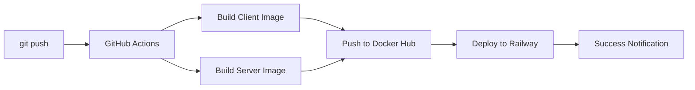

# 🚀 Первый запуск CI/CD: Пошаговое руководство

## 🧭 Оглавление

1. [Введение в CI/CD](THEORY.md)
2. [Настройка Docker Hub с нуля](DOCKERHUB_SETUP.md)
3. [GitHub Actions для начинающих](GITHUB_ACTIONS_GUIDE.md)
4. [Деплой на Railway шаг за шагом](RAILWAY_DEPLOY.md)
5. [Решение проблем CI/CD](TROUBLESHOOTING.md)
6. [Оптимизация пайплайна](OPTIMIZATION_TIPS.md)
7. [Глоссарий терминов](GLOSSARY.md)
8. [Чеклист настройки](SETUP_CHECKLIST.md)
9. [Первый запуск](FIRST_RUN.md)

## 🎯 Цель первого запуска

Убедиться, что весь CI/CD пайплайн работает корректно: от коммита кода до автоматического деплоя на продакшн.

## 📋 Предварительные условия

Перед первым запуском убедитесь, что выполнены ВСЕ пункты из [чеклиста настройки](SETUP_CHECKLIST.md):

- [ ] Все аккаунты созданы (GitHub, Docker Hub, Railway)
- [ ] Секреты добавлены в GitHub
- [ ] Репозитории Docker Hub созданы
- [ ] Проект Railway настроен
- [ ] Все файлы проекта на месте

## 🚀 Шаг 1: Подготовка к первому запуску

### Проверка текущего состояния

```bash
# Убедитесь, что находитесь в корне проекта
pwd  # Должно быть: .../STROYKA

# Проверьте статус git
git status

# Убедитесь, что все файлы добавлены
git add .
```

### Финализация изменений

```bash
# Создайте коммит для первого запуска
git commit -m "ci: Initial CI/CD setup and configuration"

# Проверьте, что ветка - main или dev
git branch --show-current
```

## ⚡ Шаг 2: Запуск CI/CD пайплайна

### Запуск через git push

```bash
# Запушьте изменения для активации workflow
git push origin main
```

**Что происходит после push:**

1. GitHub обнаруживает изменения в ветке main
2. Автоматически запускается workflow из `.github/workflows/docker-ci-cd.yml`
3. Начинается выполнение jobs в указанном порядке

## 👀 Шаг 3: Мониторинг выполнения

### Где следить за процессом:

1. **GitHub Actions вкладка**

   - Перейдите: Your Repository → Actions
   - Выберите запущенный workflow "STROYKA Docker CI/CD Pipeline"
   - Наблюдайте за выполнением в реальном времени

2. **Визуализация процесса:**



### Ключевые этапы для наблюдения:

1. **Build Client Image** - сборка образа Next.js приложения
2. **Build Server Image** - сборка образа Node.js сервера
3. **Push to Docker Hub** - публикация образов в репозитории
4. **Deploy to Railway** - автоматический деплой на продакшн

## ✅ Шаг 4: Проверка результатов

### Проверка в Docker Hub

1. Откройте [Docker Hub](https://hub.docker.com/)
2. Найдите ваши репозитории: `stroyka-client` и `stroyka-server`
3. Убедитесь, что образы с тегом `latest` обновлены
4. Проверьте размер образов (должны быть оптимизированы)

**Ожидаемый результат:**

- ✅ Образы успешно собраны
- ✅ Размер образов: 80-150MB (после оптимизации)
- ✅ Тег `latest` указывает на свежую сборку

### Проверка в Railway

1. Откройте [Railway Dashboard](https://railway.app/)
2. Перейдите в ваш проект "Stroyka"
3. Проверьте статус сервисов:

   - **Web Service** (клиент) - должен быть "Deployed"
   - **API Service** (сервер) - должен быть "Deployed"

4. Откройте домены приложения:
   - Клиент: `https://your-client.railway.app`
   - Сервер: `https://your-server.railway.app`

**Ожидаемый результат:**

- ✅ Оба сервиса в статусе "Deployed"
- ✅ Домены доступны и отвечают
- ✅ Логи деплоя без ошибок

### Проверка приложения

1. **Откройте клиентское приложение**

   - Должна загрузиться главная страница
   - Проверьте работу навигации
   - Убедитесь, что стили загружены правильно

2. **Проверьте API сервер**

   - Откройте `https://your-server.railway.app/api/health`
   - Должен вернуться статус 200 OK
   - Проверьте другие endpoints если есть

3. **Тестирование интеграции**
   - Убедитесь, что клиент может обращаться к серверу
   - Проверьте работу форм и API вызовов

## 🐛 Шаг 5: Решение 常见 проблем первого запуска

### Если workflow не запустился:

```bash
# Проверьте наличие файла workflow
ls -la .github/workflows/

# Проверьте синтаксис YAML
yamllint .github/workflows/docker-ci-cd.yml

# Принудительно запустите workflow
git commit --allow-empty -m "Trigger CI/CD"
git push origin main
```

### Если сборка падает:

1. **Проверьте логи конкретного step**
2. **Убедитесь в корректности Dockerfile**
3. **Проверьте зависимости package.json**

### Если деплой не работает:

1. **Проверьте Railway токен в секретах**
2. **Убедитесь в корректности переменных окружения**
3. **Проверьте логи деплоя в Railway**

## 📊 Шаг 6: Анализ метрик первого запуска

### Запишите ключевые метрики:

| Метрика                | Значение | Целевой показатель |
| ---------------------- | -------- | ------------------ |
| Общее время выполнения |          | < 10 минут         |
| Время сборки клиента   |          | < 3 минут          |
| Время сборки сервера   |          | < 2 минут          |
| Размер client образа   |          | < 150MB            |
| Размер server образа   |          | < 100MB            |
| Время деплоя           |          | < 5 минут          |

### Советы по оптимизации:

- Если время выполнения > 15 минут - см. [OPTIMIZATION_TIPS.md](OPTIMIZATION_TIPS.md)
- Если размер образов > 200MB - оптимизируйте Dockerfile
- Если деплой долгий - проверьте настройки Railway

## 🎉 Шаг 7: Празднуйте успех!

### Что вы достигли:

- ✅ **Полностью автоматизированный пайплайн** от кода до продакшена
- ✅ **Непрерывная интеграция** - автоматическая сборка и тестирование
- ✅ **Непрерывное развертывание** - автоматический деплой после успешной сборки
- ✅ **Профессиональная инфраструктура** на Docker и Railway

### Дальнейшие действия:

1. **Настройте кастомные домены** в Railway
2. **Добавьте базу данных** если необходимо
3. **Настройте мониторинг** и алерты
4. **Оптимизируйте** пайплайн на основе метрик

## 📝 Шаг 8: Документирование первого запуска

### Заполните чеклист:

- [ ] Workflow успешно завершился
- [ ] Образы опубликованы в Docker Hub
- [ ] Приложение развернуто на Railway
- [ ] Все сервисы доступны и работают
- [ ] Метрики записаны для будущей оптимизации

### Временные метки:

- **Время начала**: **\_\_**
- **Время завершения**: **\_\_**
- **Общая длительность**: **\_\_**

## 🔧 Шаг 9: Пост-настройка

### Настройка окружений:

1. **Development** - для тестирования новых features
2. **Staging** - для предпродакшенного тестирования
3. **Production** - основное продакшен окружение

### Настройка мониторинга:

```yaml
# Добавьте в workflow
- name: Notify on success
  if: success()
  uses: actions/slack@v1
  with:
    args: '{"text": "Deployment successful! 🎉"}'

- name: Notify on failure
  if: failure()
  uses: actions/slack@v1
  with:
    args: '{"text": "Deployment failed! ❌"}'
```

## 🆘 Получение помощи

### Если что-то пошло не так:

1. **В первую очередь** проверьте [TROUBLESHOOTING.md](TROUBLESHOOTING.md)
2. **Используйте** глоссарий из [GLOSSARY.md](GLOSSARY.md)
3. **Создайте issue** в репозитории с деталями ошибки
4. **Обратитесь** в сообщества:
   - GitHub Discussions
   - Stack Overflow
   - Railway Discord

### Ключевые ресурсы:

- [GitHub Actions Documentation](https://docs.github.com/en/actions)
- [Docker Documentation](https://docs.docker.com/)
- [Railway Documentation](https://docs.railway.app/)
- [Our CI/CD Master Guide](CI_CD_MASTER_GUIDE.md)

## 🎯 Итоги первого запуска

**Вы успешно:**

- 🚀 Настроили полноценный CI/CD пайплайн
- 🐳 Автоматизировали сборку Docker образов
- 🌐 Реализовали автоматический деплой на Railway
- 📊 Получили работающую production инфраструктуру

**Теперь при каждом `git push` ваше приложение будет автоматически:**

1. Собираться и тестироваться
2. Публиковаться в Docker Hub
3. Развертываться на продакшн
4. Становиться доступным пользователям

> 💡 **Поздравляем!** Вы только что автоматизировали один из самых важных процессов в современной разработке. Теперь вы можете сосредоточиться на написании кода, а deployment позаботится о себе сам!

---

_Этот документ является частью комплексной документации CI/CD для проекта STROYKA. Обновляйте его при изменении процесса запуска._

## 📚 Подробные руководства

Каждому аспекту CI/CD посвящен отдельный файл с пошаговыми инструкциями:

### 1. [Теория CI/CD](THEORY.md)

- Основные принципы Continuous Integration
- Разница между CI, CD и CD
- Преимущества автоматизации

### 2. [Настройка Docker Hub](DOCKERHUB_SETUP.md)

- Создание аккаунта
- Генерация токенов доступа
- Создание репозиториев
- Проверка доступа

### 3. [GitHub Actions](GITHUB_ACTIONS_GUIDE.md)

- Структура YAML файлов
- Основные компоненты workflow
- Переменные окружения и секреты
- Просмотр логов и отладка

### 4. [Деплой на Railway](RAILWAY_DEPLOY.md)

- Регистрация и настройка проекта
- Получение API токена
- Конфигурация окружения
- Мониторинг деплоев

### 5. [Решение проблем](TROUBLESHOOTING.md)

- Ошибки сборки образов
- Проблемы аутентификации
- Сбои при деплое
- Оптимизация времени выполнения

### 6. [Оптимизация](OPTIMIZATION_TIPS.md)

- Кэширование зависимостей
- Параллельное выполнение задач
- Многоступенчатые сборки
- Уменьшение размера образов

### 7. [Глоссарий](GLOSSARY.md)

- 50+ терминов CI/CD с пояснениями
- Основные команды Docker
- Ключевые понятия GitHub Actions

### 8. [Чеклист настройки](SETUP_CHECKLIST.md)

- Пошаговая проверка всех компонентов
- Валидация настроек перед запуском
- Быстрая диагностика проблем

### 9. [Первый запуск](FIRST_RUN.md)

- Пошаговое руководство для первого запуска
- Мониторинг выполнения пайплайна
- Проверка результатов и устранение неполадок
