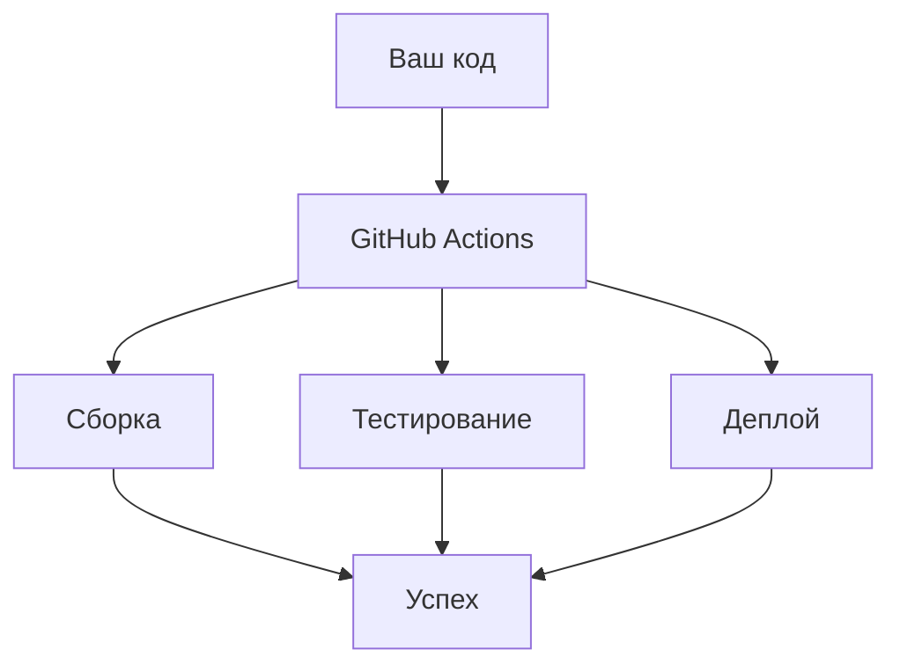

# 🚀 GitHub Actions для начинающих: Полное руководство

## 🧭 Оглавление

1. [Введение в CI/CD](THEORY.md)
2. [Настройка Docker Hub с нуля](DOCKERHUB_SETUP.md)
3. [GitHub Actions для начинающих](GITHUB_ACTIONS_GUIDE.md)
4. [Деплой на Railway шаг за шагом](RAILWAY_DEPLOY.md)
5. [Решение проблем CI/CD](TROUBLESHOOTING.md)
6. [Оптимизация пайплайна](OPTIMIZATION_TIPS.md)
7. [Глоссарий терминов](GLOSSARY.md)
8. [Чеклист настройки](SETUP_CHECKLIST.md)
9. [Первый запуск](FIRST_RUN.md)

## 📖 Введение

GitHub Actions - это встроенная в GitHub система автоматизации, которая позволяет создавать, тестировать и развертывать ваш код прямо из репозитория.



## 🏗️ Основные компоненты

### 1. Workflow (Пайплайн)

Файл YAML, который описывает весь процесс автоматизации. Находится в `.github/workflows/`

### 2. Job (Задача)

Набор шагов, которые выполняются на одном раннере. Может зависеть от других jobs.

### 3. Step (Шаг)

Отдельная команда или действие, которое выполняется в job.

### 4. Action (Действие)

Переиспользуемый блок кода, который можно включать в steps.

## 📁 Структура папок

```
.github/
└── workflows/
    └── ci-cd.yml    # Основной workflow файл
```

## 🧩 Анатомия workflow файла

### Базовый пример:

```yaml
name: CI/CD Pipeline # Название пайплайна

on: # Триггеры запуска
  push:
    branches: [main]
  pull_request:
    branches: [main]

jobs: # Задачи
  build: # Имя задачи
    runs-on: ubuntu-latest # ОС для выполнения

    steps: # Шаги выполнения
      - name: Checkout code # Название шага
        uses: actions/checkout@v4 # Используемое действие

      - name: Setup Node.js
        uses: actions/setup-node@v4
        with: # Параметры действия
          node-version: '20'
```

## 🎯 Триггеры (on)

Когда запускать пайплайн:

```yaml
on:
  # При пуше в ветки
  push:
    branches: [main, dev]
    tags: [v*.*.*] # При создании тегов версий

  # При pull request
  pull_request:
    branches: [main]

  # По расписанию (каждый день в 8 утра)
  schedule:
    - cron: '0 8 * * *'

  # Вручную из интерфейса
  workflow_dispatch:
```

## 🏃‍♂️ Jobs и стратегии

### Параллельное выполнение:

```yaml
jobs:
  test-client:
    runs-on: ubuntu-latest
    steps: [...]

  test-server:
    runs-on: ubuntu-latest
    steps: [...]

  build:
    needs: [test-client, test-server] # Зависимости
    runs-on: ubuntu-latest
    steps: [...]
```

### Матрица сборок:

```yaml
jobs:
  test:
    strategy:
      matrix:
        node-version: [16, 18, 20]
        os: [ubuntu-latest, windows-latest]
    runs-on: ${{ matrix.os }}
    steps:
      - uses: actions/setup-node@v4
        with:
          node-version: ${{ matrix.node-version }}
```

## 🔑 Переменные и секреты

### Переменные окружения:

```yaml
env:
  NODE_ENV: production
  API_URL: https://api.example.com

jobs:
  build:
    env:
      BUILD_VERSION: ${{ github.sha }}
```

### Секреты (безопасное хранение):

```yaml
steps:
  - name: Deploy to production
    env:
      AWS_ACCESS_KEY: ${{ secrets.AWS_ACCESS_KEY }}
      AWS_SECRET_KEY: ${{ secrets.AWS_SECRET_KEY }}
```

## 📊 Встроенные переменные GitHub

```yaml
steps:
  - name: Show info
    run: |
      echo "Repository: ${{ github.repository }}"
      echo "SHA: ${{ github.sha }}"
      echo "Ref: ${{ github.ref }}"
      echo "Actor: ${{ github.actor }}"
      echo "Run ID: ${{ github.run_id }}"
```

## 🛠️ Популярные действия (Actions)

### Базовые действия:

```yaml
steps:
  # Забрать код из репозитория
  - uses: actions/checkout@v4

  # Настроить Node.js
  - uses: actions/setup-node@v4
    with:
      node-version: '20'
      cache: 'npm'

  # Кэширование зависимостей
  - uses: actions/cache@v3
    with:
      path: node_modules
      key: ${{ runner.os }}-node-${{ hashFiles('package-lock.json') }}
```

### Docker действия:

```yaml
steps:
  # Сборка и публикация Docker образа
  - uses: docker/build-push-action@v4
    with:
      context: .
      push: true
      tags: user/app:latest
```

## 📝 Пример полного workflow

```yaml
name: Node.js CI/CD

on: [push, pull_request]

jobs:
  test:
    runs-on: ubuntu-latest

    steps:
      - uses: actions/checkout@v4

      - name: Setup Node.js
        uses: actions/setup-node@v4
        with:
          node-version: '20'
          cache: 'npm'

      - name: Install dependencies
        run: npm ci

      - name: Run tests
        run: npm test

      - name: Build project
        run: npm run build

  deploy:
    needs: test
    runs-on: ubuntu-latest
    if: github.ref == 'refs/heads/main'

    steps:
      - uses: actions/checkout@v4

      - name: Deploy to server
        run: |
          echo "Deploying to production..."
          # Команды деплоя
```

## 🔍 Отладка и мониторинг

### Просмотр логов:

1. Перейдите в репозитории → Вкладка "Actions"
2. Выберите нужный workflow run
3. Нажмите на job для просмотра деталей
4. Раскройте шаги для просмотра логов

### Включение дебаг режима:

```yaml
name: CI/CD Pipeline

on:
  workflow_dispatch:
    inputs:
      debug:
        description: 'Enable debug mode'
        required: false
        default: 'false'

jobs:
  build:
    runs-on: ubuntu-latest
    steps:
      - name: Debug info
        if: ${{ github.event.inputs.debug == 'true' }}
        run: |
          echo "Debug mode enabled"
          env
```

## 💡 Советы для начинающих

1. **Начинайте с малого** - сначала простые задачи, потом сложные
2. **Используйте кэширование** - ускоряет выполнение
3. **Пишите понятные имена** - для шагов и jobs
4. **Тестируйте на ветках** - перед мерджем в main
5. **Мониторьте выполнение** - смотрите логи при ошибках

## 🚀 Пример для нашего проекта

Вот как выглядит наш основной workflow:

```yaml
name: STROYKA Docker CI/CD Pipeline

on:
  push:
    branches: ['dev', 'main']
    tags: ['v*.*.*']
  pull_request:
    branches: ['dev', 'main']

env:
  DOCKERHUB_USERNAME: dencheny123
  CLIENT_IMAGE_NAME: dencheny123/stroyka-client
  SERVER_IMAGE_NAME: dencheny123/stroyka-server

jobs:
  build-and-push:
    runs-on: ubuntu-latest
    steps:
      - name: Checkout code
        uses: actions/checkout@v4
    # ... остальные шаги
```

## 📚 Дополнительные ресурсы

- [Официальная документация](https://docs.github.com/en/actions)
- [GitHub Actions Marketplace](https://github.com/marketplace?type=actions)
- [Примеры workflow](https://github.com/actions/starter-workflows)

Теперь вы готовы создавать свои собственные GitHub Actions workflows! 🎉

## 📚 Подробные руководства

Каждому аспекту CI/CD посвящен отдельный файл с пошаговыми инструкциями:

### 1. [Теория CI/CD](THEORY.md)

- Основные принципы Continuous Integration
- Разница между CI, CD и CD
- Преимущества автоматизации

### 2. [Настройка Docker Hub](DOCKERHUB_SETUP.md)

- Создание аккаунта
- Генерация токенов доступа
- Создание репозиториев
- Проверка доступа

### 3. [GitHub Actions](GITHUB_ACTIONS_GUIDE.md)

- Структура YAML файлов
- Основные компоненты workflow
- Переменные окружения и секреты
- Просмотр логов и отладка

### 4. [Деплой на Railway](RAILWAY_DEPLOY.md)

- Регистрация и настройка проекта
- Получение API токена
- Конфигурация окружения
- Мониторинг деплоев

### 5. [Решение проблем](TROUBLESHOOTING.md)

- Ошибки сборки образов
- Проблемы аутентификации
- Сбои при деплое
- Оптимизация времени выполнения

### 6. [Оптимизация](OPTIMIZATION_TIPS.md)

- Кэширование зависимостей
- Параллельное выполнение задач
- Многоступенчатые сборки
- Уменьшение размера образов

### 7. [Глоссарий](GLOSSARY.md)

- 50+ терминов CI/CD с пояснениями
- Основные команды Docker
- Ключевые понятия GitHub Actions

### 8. [Чеклист настройки](SETUP_CHECKLIST.md)

- Пошаговая проверка всех компонентов
- Валидация настроек перед запуском
- Быстрая диагностика проблем

### 9. [Первый запуск](FIRST_RUN.md)

- Пошаговое руководство для первого запуска
- Мониторинг выполнения пайплайна
- Проверка результатов и устранение неполадок
