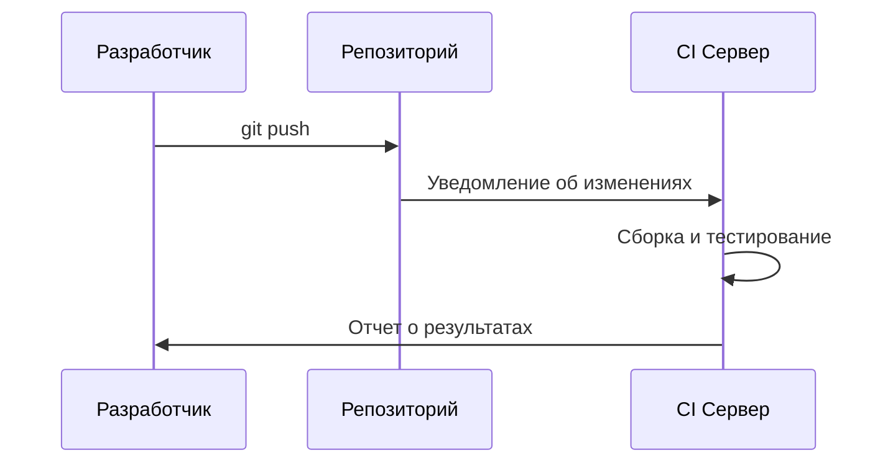
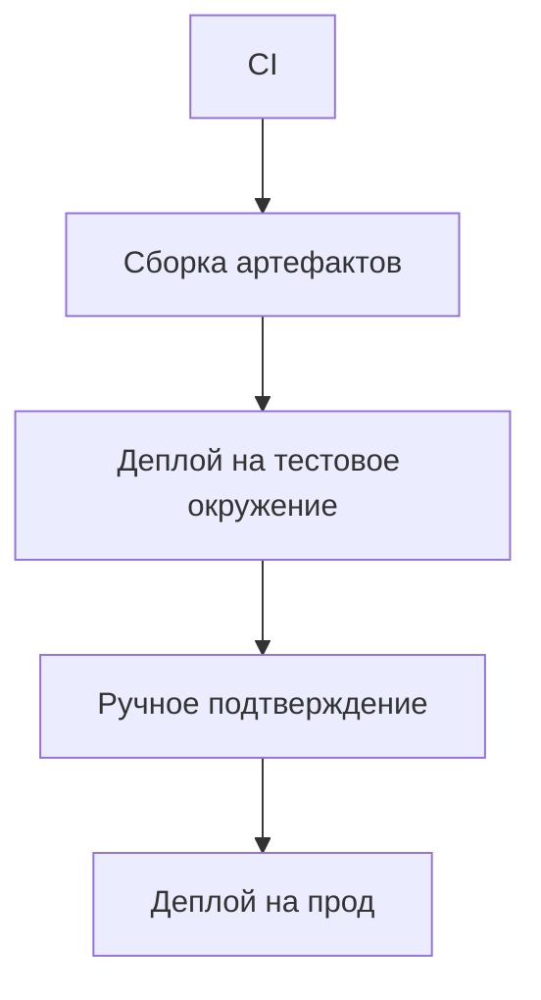
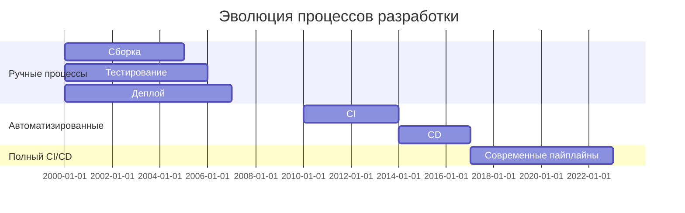

# 📚 Теория CI/CD для начинающих

## 🧭 Оглавление

1. [Введение в CI/CD](THEORY.md)
2. [Настройка Docker Hub с нуля](DOCKERHUB_SETUP.md)
3. [GitHub Actions для начинающих](GITHUB_ACTIONS_GUIDE.md)
4. [Деплой на Railway шаг за шагом](RAILWAY_DEPLOY.md)
5. [Решение проблем CI/CD](TROUBLESHOOTING.md)
6. [Оптимизация пайплайна](OPTIMIZATION_TIPS.md)
7. [Глоссарий терминов](GLOSSARY.md)
8. [Чеклист настройки](SETUP_CHECKLIST.md)
9. [Первый запуск](FIRST_RUN.md)

## 🤔 Что такое CI/CD?

**CI/CD** - это практика автоматизации процессов разработки программного обеспечения:

- **CI (Continuous Integration)** - Непрерывная интеграция
- **CD (Continuous Delivery/Deployment)** - Непрерывная поставка/развертывание

## 🔄 Непрерывная интеграция (CI)

Процесс автоматической сборки и тестирования кода при каждом изменении:

### Основные этапы:

1. Разработчик делает commit в репозиторий
2. CI сервер автоматически:
   - Забирает последние изменения
   - Собирает приложение
   - Запускает тесты
3. Отправляет отчет о результатах

### Преимущества CI:

- Раннее обнаружение ошибок
- Снижение рисков интеграции
- Постоянно работоспособная основная ветка
- Автоматизация рутинных задач

## 🚚 Непрерывная поставка (CD)

Процесс автоматической подготовки изменений к развертыванию:

### Ключевые особенности:

- Каждое изменение готово к развертыванию
- Автоматизированное создание артефактов
- Простое и быстрое развертывание
- Минимальное время между разработкой и поставкой

## 🚀 Непрерывное развертывание (CD)

Автоматическое развертывание каждого успешного изменения в продакшн:

### Преимущества:

- Мгновенная доставка изменений пользователям
- Минимизация ручного труда
- Снижение рисков при развертывании
- Возможность делать частые небольшие обновления

## 🧩 Основные компоненты CI/CD системы

### 1. Система контроля версий (Git)

Хранит историю изменений и позволяет работать в команде

### 2. CI Сервер (GitHub Actions)

Автоматизирует процессы сборки и тестирования

### 3. Репозиторий артефактов (Docker Hub)

Хранит собранные версии приложения (образы, пакеты)

### 4. Система развертывания (Railway)

Автоматически обновляет приложение на серверах

### 5. Мониторинг и нотификации

Отслеживает статус процессов и уведомляет о проблемах

## 🌟 Почему CI/CD важен?

### Для разработчиков:

- Меньше ручной работы
- Быстрая обратная связь
- Возможность сосредоточиться на коде
- Снижение стресса при деплое

### Для бизнеса:

- Ускорение выхода на рынок
- Повышение качества продукта
- Снижение затрат на разработку
- Увеличение частоты обновлений

## 📊 Эволюция процессов разработки

## 🧠 Основные принципы

### 1. Автоматизация всего

Чем больше процессов автоматизировано, тем меньше ошибок

### 2. Частые коммиты

Мелкие изменения легче тестировать и интегрировать

### 3. Быстрая обратная связь

Разработчик должен знать о проблемах как можно скорее

### 4. Воспроизводимость

Сборки и деплои должны быть предсказуемыми

### 5. Непрерывное улучшение

Постоянная оптимизация процессов

## 📚 Ресурсы для дальнейшего изучения

- [Martin Fowler о Continuous Integration](https://martinfowler.com/articles/continuousIntegration.html)
- [GitLab CI/CD Handbook](https://about.gitlab.com/handbook/engineering/development/cicd/)
- [Книга "Continuous Delivery"](https://continuousdelivery.com/)

> 💡 Понимание этих основ поможет вам эффективно использовать CI/CD пайплайн в проекте STROYKA!

## 📚 Подробные руководства

Каждому аспекту CI/CD посвящен отдельный файл с пошаговыми инструкциями:

### 1. [Теория CI/CD](THEORY.md)

- Основные принципы Continuous Integration
- Разница между CI, CD и CD
- Преимущества автоматизации

### 2. [Настройка Docker Hub](DOCKERHUB_SETUP.md)

- Создание аккаунта
- Генерация токенов доступа
- Создание репозиториев
- Проверка доступа

### 3. [GitHub Actions](GITHUB_ACTIONS_GUIDE.md)

- Структура YAML файлов
- Основные компоненты workflow
- Переменные окружения и секреты
- Просмотр логов и отладка

### 4. [Деплой на Railway](RAILWAY_DEPLOY.md)

- Регистрация и настройка проекта
- Получение API токена
- Конфигурация окружения
- Мониторинг деплоев

### 5. [Решение проблем](TROUBLESHOOTING.md)

- Ошибки сборки образов
- Проблемы аутентификации
- Сбои при деплое
- Оптимизация времени выполнения

### 6. [Оптимизация](OPTIMIZATION_TIPS.md)

- Кэширование зависимостей
- Параллельное выполнение задач
- Многоступенчатые сборки
- Уменьшение размера образов

### 7. [Глоссарий](GLOSSARY.md)

- 50+ терминов CI/CD с пояснениями
- Основные команды Docker
- Ключевые понятия GitHub Actions

### 8. [Чеклист настройки](SETUP_CHECKLIST.md)

- Пошаговая проверка всех компонентов
- Валидация настроек перед запуском
- Быстрая диагностика проблем

### 9. [Первый запуск](FIRST_RUN.md)

- Пошаговое руководство для первого запуска
- Мониторинг выполнения пайплайна
- Проверка результатов и устранение неполадок
